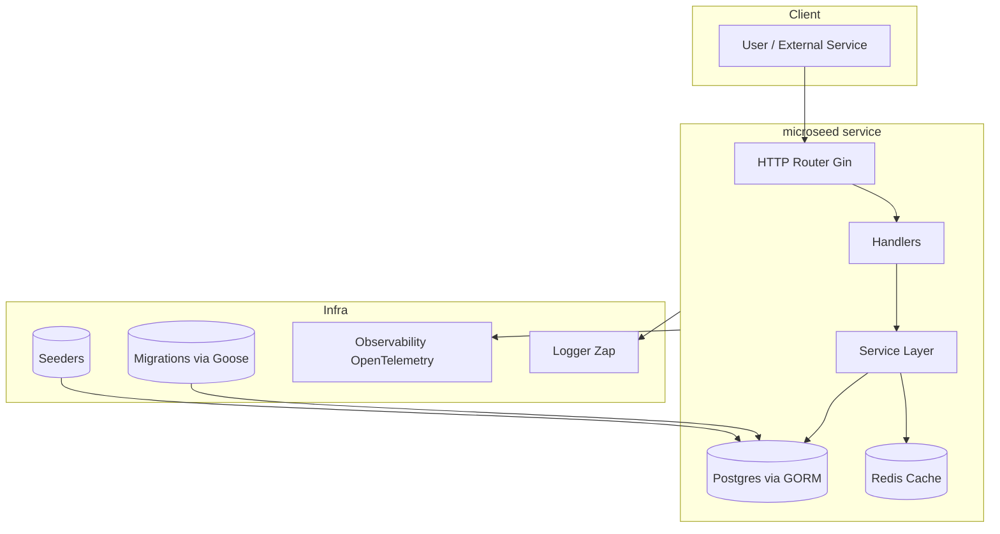

# microseed — Go Microservice Skeleton

A small but production-grade starter for building HTTP microservices in Go.  
It includes a clean architecture, dependency injection with `fx`, embedded database migrations (`goose`), seeding, and graceful shutdown.

---

## ✨ Features

- **Go + Fx** for dependency injection and lifecycle management
- **Gin** as HTTP router with middleware (logging, request ID, recovery, OpenTelemetry)
- **GORM** for ORM (Postgres driver included)
- **Redis** client (go-redis v9)
- **Goose migrations** embedded in binary (no external migration runner needed)
- **Seeders** for populating initial test/demo data
- **Cobra CLI** with commands:
    - `serve` → run HTTP API
    - `migrate up|down|reset` → run DB migrations
    - `seed` → run data seeding
- **Graceful shutdown** with configurable timeout
- **Health endpoints** (`/healthz`, `/readyz`) including DB and Redis readiness checks
- **JSON logging** with human-readable timestamps, configurable outputs (console + file with rotation)
- **Environment-based configuration** via Viper

---

## 📦 Project Structure

```
go-microseed/
├─ go.mod
├─ README.md
├─ .env.example             # local configuration example
├─ Makefile                 # common commands
├─ Dockerfile               # build lightweight container
├─ cmd/
│  └─ app/
│     └─ main.go            # Cobra CLI entrypoint
├─ internal/
│  ├─ app/
│  │  └─ module.go          # Compose all Fx modules
│  ├─ cache/
│  │  └─ redis.go           # Redis client + lifecycle hooks
│  ├─ config/
│  │  └─ config.go          # Viper-based config loader
│  ├─ db/
│  │  └─ gorm.go            # GORM initialization + hooks
│  ├─ httpx/
│  │  ├─ middleware.go      # Logging, request ID, recovery
│  │  ├─ router.go          # Gin engine
│  │  └─ routes_registry.go # Auto-register all route modules
│  ├─ log/
│  │  └─ log.go             # JSON logger (console + file)
│  ├─ obs/
│  │  └─ otel.go            # OpenTelemetry tracing
│  ├─ server/
│  │  └─ http_server.go     # HTTP server + graceful shutdown
│  ├─ domain/
│  │  ├─ health/
│  │  │  ├─ handler.go      # /healthz and /readyz endpoints
│  │  │  └─ module.go
│  │  └─ user/
│  │     ├─ service.go      # User domain service
│  │     ├─ handler.go      # HTTP handler for /v1/users
│  │     └─ module.go
│  ├─ migrate/
│  │  ├─ goose.go           # Goose migration runner
│  │  └─ migrations/
│  │     └─ 20250901100000_create_users.sql
│  └─ seed/
│     └─ seed.go            # Seed initial user data
└─ pkg/
   └─ id/
      └─ id.go              # Utility for UUID generation
```

---

## 🚀 Quick start

### Prerequisites
- Go 1.21+ recommended
- PostgreSQL database
- Redis (optional, for cache)

### Run locally
```bash
cp .env.example .env
go mod tidy
go run ./cmd/app serve
# healthz:  http://localhost:8080/healthz
# readyz:   http://localhost:8080/readyz
```

---

## 🛠 CLI

```bash
# Run API
go run ./cmd/app serve

# DB migrations (embedded via goose)
go run ./cmd/app migrate up
go run ./cmd/app migrate down --step 1
go run ./cmd/app migrate reset

# Seed data
go run ./cmd/app seed
```

---

## 🧰 Makefile usage

```bash
# Run API
make run

# Build binary (outputs bin/microseed)
make build

# DB migrations
make migrate-up
make migrate-down    # rollback one step
make migrate-reset

# Seed data
make seed

# Format and test
make fmt
make test
```

---

## ⚙️ Configuration

All configuration is provided via `.env` file or environment variables.

Key variables:
- `APP_NAME` → service name
- `HTTP_ADDR` → listen address (default `:8080`)
- `GRACEFUL_TIMEOUT` → shutdown timeout (default 10s)
- `DB_DSN` → PostgreSQL connection string (GORM + goose)
- `REDIS_ADDR` → Redis connection (default `localhost:6379`)
- `OTEL_EXPORTER_OTLP_ENDPOINT` → OpenTelemetry collector (optional)
- Logging:
    - `LOG_LEVEL` (debug, info, warn, error)
    - `LOG_CONSOLE` (true/false)
    - `LOG_FILE_PATH` (optional, JSON log with rotation)
    - `LOG_FILE_MAX_SIZE_MB`, `LOG_FILE_MAX_BACKUPS`, `LOG_FILE_MAX_AGE_DAYS`

Example:
```env
APP_NAME=microseed
HTTP_ADDR=:8080
GRACEFUL_TIMEOUT=10s

DB_DSN=host=localhost user=postgres password=postgres dbname=microseed port=5432 sslmode=disable TimeZone=Asia/Jakarta

REDIS_ADDR=localhost:6379

LOG_LEVEL=info
LOG_CONSOLE=true
LOG_FILE_PATH=logs/app.jsonl
```

---

## 💓 Health endpoints

- `GET /healthz` → liveness probe
- `GET /readyz` → readiness probe (checks DB + Redis)

---

## 🔮 Roadmap ideas

- Add gRPC or Connect-Go server
- Add message queue integration (Kafka / NATS) via Watermill
- Add JWT auth + RBAC (Casbin)
- Add integration tests with Testcontainers
- Add Swagger/OpenAPI generator

---

## 🏗 Architecture Diagram


